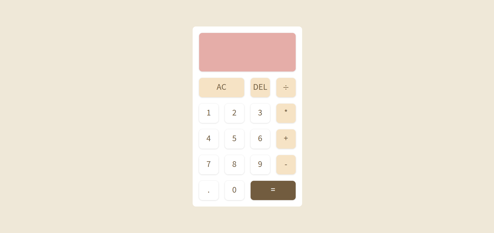

# Simple Calculator (Practice Project)

This is a **basic calculator web app** built for practice.  
It demonstrates HTML, CSS, and JavaScript working together to create a functional UI.

## Features

- Basic arithmetic operations: addition, subtraction, multiplication, division
- Clear (AC) and delete (DEL) buttons
- Buttons styled using `data-*` attributes for easy targeting

## Files

- `index.html` — main HTML structure
- `styles.css` — styling for the calculator and wrapper
- `script.js` — JavaScript functionality for button actions and calculations

## Usage

1. Open `index.html` in your browser.
2. Click the number and operation buttons to perform calculations.
3. Use `AC` to clear all and `DEL` to delete the last digit.
4. The result will display at the top of the calculator.

## Screenshot

## Notes

- This project is for **practice purposes** and learning how HTML, CSS, and JavaScript interact.

## Author

- Nway Nway Zay Ya
